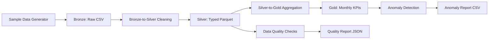

# Ontario Housing Data Quality & Observability Platform

[](https://github.com/R-venkey/ontario-housing-data-observability/actions/workflows/ci.yml)

A local-first reference implementation for ingesting, transforming, monitoring,
and analyzing Ontario housing market data.

## Business Problem

Housing data often arrives from multiple boards, municipalities, and vendors
with inconsistent city names, malformed dates, missing periods, duplicate
records, and invalid numeric values. These issues can undermine market reports,
forecasting, policy analysis, and executive dashboards.

This project demonstrates a medallion data pipeline that:

- Generates representative housing transactions for six Ontario cities.
- Standardizes and validates raw records before analytics use.
- Publishes monthly city-level KPIs.
- Measures data quality and identifies material market anomalies.
- Produces reproducible outputs that can later be orchestrated and visualized.

## Architecture



### Data Layers

| Layer | Purpose | Output |
| --- | --- | --- |
| Bronze | Preserve raw source records | `data/bronze/ontario_housing_raw.csv` |
| Silver | Clean, type, standardize, and deduplicate | `data/silver/ontario_housing_clean.parquet` |
| Gold | Publish monthly KPIs by city | `data/gold/monthly_city_kpis.parquet` |
| Observability | Report quality failures and market anomalies | JSON and CSV reports in `data/gold/` |

## Tech Stack

- Python 3.10+
- pandas for transformation and aggregation
- NumPy for reproducible sample generation
- PyArrow for Parquet storage
- pytest for automated quality-check tests
- Git/GitHub for source control

The scaffold is intentionally orchestration-neutral. Airflow, cloud storage,
dbt, Great Expectations, and a dashboard can be added in later phases.

## Project Structure

```text
.
|-- ingestion/
|   `-- sample_data_generator.py
|-- transformations/
|   |-- bronze_to_silver.py
|   `-- silver_to_gold.py
|-- observability/
|   |-- quality_checks.py
|   `-- anomaly_detection.py
|-- dashboard/
|   |-- app.py
|   |-- data_service.py
|   `-- power_bi_exports.py
|-- docs/
|   |-- architecture.md
|   `-- data_dictionary.md
|-- tests/
|   |-- test_power_bi_exports.py
|   `-- test_quality_checks.py
|-- data/
|   |-- bronze/
|   |-- exports/
|   |-- silver/
|   `-- gold/
|-- .github/workflows/ci.yml
`-- requirements.txt
```

## Run Locally

From the repository root:

```powershell
python -m venv .venv
.\.venv\Scripts\Activate.ps1
python -m pip install -r requirements.txt
```

Run the full pipeline:

```powershell
python ingestion/sample_data_generator.py
python transformations/bronze_to_silver.py
python transformations/silver_to_gold.py
python observability/quality_checks.py
python observability/anomaly_detection.py
pytest
```

Each script supports `--help` and optional input/output paths. The generator is
deterministic by default, so repeated runs produce the same sample data.

Launch the interactive dashboard:

```powershell
streamlit run dashboard/app.py
```

The dashboard opens at `http://localhost:8501` and will generate the local
pipeline outputs automatically if they do not already exist.

Create flat CSV datasets for Power BI:

```powershell
python dashboard/power_bi_exports.py
```

The exports are written to `data/exports/` and include transactions, monthly
KPIs, quality checks, and anomaly records. Generated data files are excluded
from Git.

## Screenshots

Portfolio screenshots can be added at these stable paths:

- `docs/images/dashboard-overview.png`
- `docs/images/dashboard-quality-anomalies.png`
- `docs/images/power-bi-model.png`

<!--


-->

## Documentation

- [Architecture and data flow](docs/architecture.md)
- [Data dictionary](docs/data_dictionary.md)

## Gold KPIs

The monthly gold dataset contains:

- `average_price`
- `median_price`
- `sales_volume`
- `average_days_on_market`
- `average_bedrooms`

## Quality and Anomaly Rules

The quality report measures:

- Null values in required columns
- Duplicate records
- Non-positive or implausibly high sale prices
- Missing monthly observations by city

The overall quality score is a percentage based on the share of checks that
pass. The anomaly detector flags absolute month-over-month changes greater than
20% in average price or sales volume.

## Project Phases

1. **Foundation:** Local generation, medallion transformations, tests, and
   observability reports.
2. **Orchestration:** Schedule pipeline tasks with Airflow and add retries,
   lineage, and service-level objectives.
3. **Cloud Platform:** Move storage and compute to a cloud data lake or
   warehouse and add CI/CD.
4. **Analytics:** Build dashboards for market KPIs, quality trends, and anomaly
   investigation.
5. **Production Observability:** Add alert routing, historical score tracking,
   schema contracts, freshness monitoring, and incident workflows.

## Disclaimer

The generated records are synthetic and intended for engineering
demonstrations only. They are not official market statistics.
