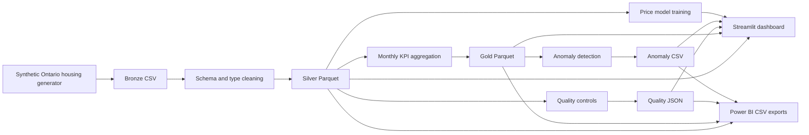

# Architecture

## Overview

The Ontario Housing Data Quality & Observability Platform is a local-first
analytics pipeline organized around the medallion architecture. Synthetic
transaction data moves through raw, cleaned, and aggregated layers before it is
served to the Streamlit dashboard or exported for Power BI.



## Components

### Ingestion

`ingestion/sample_data_generator.py` creates deterministic transaction-level
records for Toronto, Oshawa, Mississauga, Ottawa, Hamilton, and Brampton. City
profiles, seasonality, property types, and seeded random variation make the
dataset reproducible while preserving realistic differences between markets.

### Bronze Layer

`data/bronze/ontario_housing_raw.csv` is the immutable landing representation.
It preserves the source-oriented string formats that a production ingestion
job would receive. Generated data is intentionally excluded from Git.

### Silver Layer

`transformations/bronze_to_silver.py`:

1. Validates required columns.
2. Trims and standardizes city and property-type values.
3. Parses sale dates.
4. Coerces price, bedroom, and days-on-market fields to numeric types.
5. Removes duplicate record identifiers and duplicate rows.
6. Sorts the result and writes Parquet.

The silver dataset is the trusted transaction-level source for downstream
quality analysis and reporting.

### Gold Layer

`transformations/silver_to_gold.py` groups valid transactions by city and month.
It publishes average price, median price, sales volume, average days on market,
and average bedrooms as analytics-ready Parquet.

### Observability

`observability/quality_checks.py` evaluates completeness, uniqueness, price
validity, and monthly coverage. The report includes issue counts and a quality
score based on the percentage of controls that pass.

`observability/anomaly_detection.py` calculates month-over-month changes in
average price and sales volume. Absolute changes greater than 20 percent are
written to the anomaly report for investigation.

### Presentation and Export

`dashboard/app.py` provides interactive city and date filters, market KPI cards,
trend charts, quality status, anomaly visualization, and recent transactions.
`dashboard/data_service.py` generates missing local outputs and provides one
typed loading interface for presentation tools.

`dashboard/power_bi_exports.py` flattens the silver, gold, quality, and anomaly
outputs into stable CSV files under `data/exports/`. These files can be loaded
directly with Power BI's Folder or Text/CSV connectors.

### Predictive Model

`modeling/price_model.py` trains a random-forest regression pipeline using city,
property type, bedrooms, days on market, sale year, and sale month. Categorical
features are one-hot encoded inside the model pipeline. A held-out test split
produces mean absolute error and R-squared metrics, while the 80th percentile of
absolute test errors defines the displayed estimate range.

The dashboard accepts a street address for display context only. The address is
not geocoded, stored, or used as a feature because the synthetic source data has
no street, postal-code, latitude, or longitude fields.

## Execution Flow

```text
sample_data_generator.py
    -> bronze_to_silver.py
    -> silver_to_gold.py
    -> quality_checks.py
    -> anomaly_detection.py
    -> Streamlit or Power BI exports
```

The dashboard can bootstrap this flow when outputs are absent. Explicit script
execution remains the preferred pattern for scheduled or production workloads.

## Storage and Version Control

Code, tests, configuration, documentation, and empty layer markers are tracked.
Generated CSV, Parquet, and JSON artifacts are ignored to keep the repository
small, reproducible, and free from derived data.

## Testing and CI

Pytest covers quality rules and Power BI export contracts. GitHub Actions runs
the suite with Python 3.11 on pushes to `main` and on pull requests. The
workflow also compiles Python sources before testing to catch syntax errors.

## Production Evolution

The current boundaries support replacing local files with object storage,
moving transformations into distributed compute or dbt, scheduling tasks with
Airflow, persisting quality history, and routing incidents to an alerting
platform without changing the reporting contracts.
